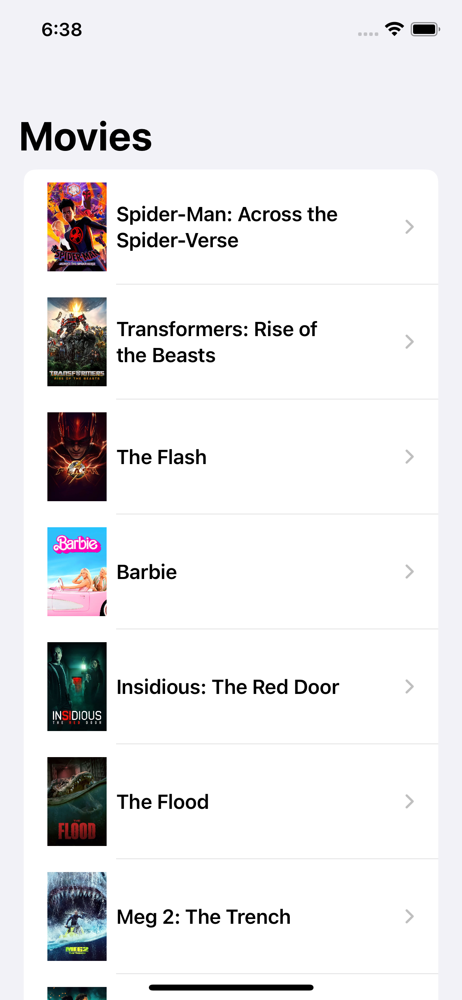
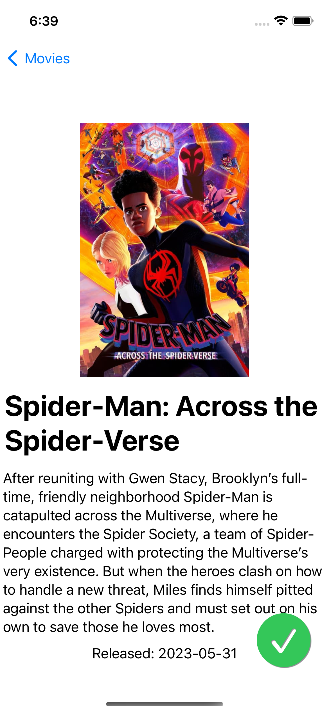
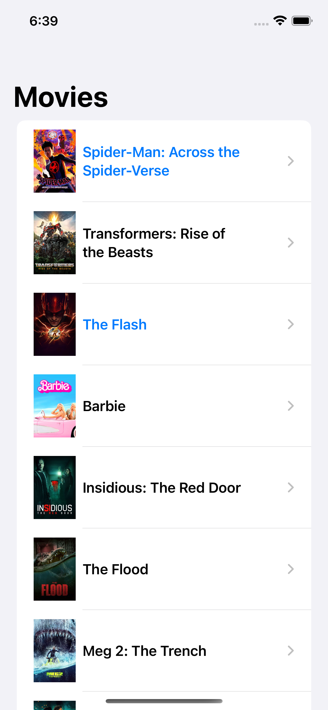

# Popular Movies (TCA)

A new approach of Popular Movies project from [Udacity's Android Developer Nanodegree](https://www.udacity.com/course/android-developer-nanodegree-by-google--nd801) that uses [TMDB API](https://developers.themoviedb.org/3/getting-started/introduction).

Again, it's easier to keep reusing the same project, API keys, etc., in order to focus in the main goal and don't waste time with details. It's also good to compare different architectures used in the same app.

This time, I'm trying the popular [Composable Architecture](https://www.pointfree.co/collections/composable-architecture) from Point Free that finally reached the 1.0.0 milestone and provides a solid framework which pillars are: composition, testing and ergonomics. I hope to write a new article soon about this experience.

## Key points
- Master/detail UI
- Shared state between parent and children (tap the FAB on the movie details and check the main list updated)
- SwiftUI
- Async/Await
- Unit tests

## Run App

API key must be added on a new file: `/PopularMoviesSwiftUI/Secrets.xcconfig`

```
  movies_api_key = xxxxxxxxxxxxxxxxxx
```

You can grab an API key for free [here](https://developers.themoviedb.org/3/getting-started/introduction)

## Screenshots

<table align="center">
  <tr>
     <td>
       
     </td>
     <td>
       
     </td>
     <td>
       
     </td>
  </tr>
</table>

## Copyright

Project developed by Márcio Souza de Oliveira.
